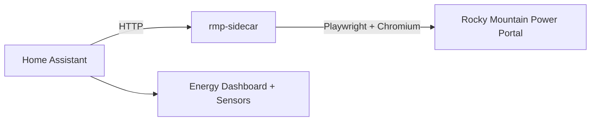

# Rocky Mountain Power for Home Assistant

[![GitHub Release][releases-shield]][releases]
[![Tests][tests-shield]][tests]
[![hacs][hacsbadge]][hacs]
[![License][license-shield]](LICENSE)

Bring your Rocky Mountain Power billing, forecast, and usage data into Home Assistant.

This project has two parts:

1. A **Home Assistant custom integration** that creates sensors and imports energy statistics.
2. A **Playwright sidecar** container that scrapes the Rocky Mountain Power portal on behalf of Home Assistant.

The sidecar exists because the official Home Assistant Docker image is Alpine-based and cannot run Playwright/Chromium directly.



## Prerequisites

- Docker and Docker Compose on the host machine.
- A Rocky Mountain Power account with **MFA / 2FA disabled** (browser automation cannot complete MFA prompts).

## Setup

### 1. Clone the repository

```bash
git clone https://github.com/nate-kelley-buster/rocky-mountain-power-home-assistant.git
cd rocky-mountain-power-home-assistant
```

### 2. Start the sidecar

```bash
docker compose up -d --build
```

Verify it is healthy:

```bash
docker compose ps
curl http://localhost:8080/health
```

Expected response:

```json
{"status":"ok"}
```

### 3. Install the Home Assistant integration

**Option A -- HACS (recommended)**

[![Open HACS repository][hacs-badge-img]][hacs-repo-link]

1. Open HACS in Home Assistant.
2. Menu (top-right) -> Custom repositories.
3. Add `https://github.com/nate-kelley-buster/rocky-mountain-power-home-assistant` as an **Integration**.
4. Install **Rocky Mountain Power**.
5. Restart Home Assistant.

**Option B -- Manual**

Copy `custom_components/rocky_mountain_power/` into your Home Assistant config directory:

```
<ha-config>/custom_components/rocky_mountain_power/
```

Restart Home Assistant.

### 4. Configure the integration

1. Go to **Settings -> Devices & Services -> Add Integration**.
2. Search for **Rocky Mountain Power**.
3. Enter:
   - Rocky Mountain Power username
   - Rocky Mountain Power password
   - Sidecar base URL (see [Networking](#networking) below)

## Networking

Home Assistant must be able to reach the sidecar over HTTP.

| Setup | Sidecar URL to enter |
|-------|---------------------|
| HA and sidecar on the same Docker network | `http://rmp-sidecar:8080` |
| HA using `network_mode: host` with sidecar port published | `http://localhost:8080` |
| HA on a different host | `http://<sidecar-host-ip>:8080` |

If HA runs with `network_mode: host` (common), and the sidecar publishes port 8080 on the same machine, `http://localhost:8080` works.

## What You Get

### Sensors

- Current bill forecasted cost (and low/high estimates)
- Current balance due
- Payment due date
- Past due amount
- Last payment amount and date
- Next statement date

### Energy Dashboard statistics

- Monthly, daily, and interval (hourly or 15-minute) usage and cost history
- Automatic interval detection per meter

### Options

The default polling interval is 12 hours. Change it in **Settings -> Devices & Services -> Rocky Mountain Power -> Configure**.

Available intervals: 1h, 2h, 4h, 6h, 8h, 12h, 24h.

## Troubleshooting

**Sidecar health check fails**

- Confirm the container is running: `docker compose ps`
- Check logs: `docker compose logs rmp-sidecar`
- The first start takes longer while Chromium initializes; the health check has a 60-second start period.

**Home Assistant cannot connect to the sidecar**

- Verify the URL you entered in the integration config.
- From inside the HA container, test connectivity: `curl http://<sidecar-url>/health`.
**Login fails (invalid_auth)**

- Confirm MFA / 2FA is disabled on your Rocky Mountain Power account.
- Verify username and password are correct.
- Check sidecar logs for details: `docker compose logs rmp-sidecar`.

**No data appears after setup**

- The first poll may take a few minutes while the sidecar scrapes the portal.
- Check Home Assistant logs for `rocky_mountain_power` entries.
- Rocky Mountain Power may temporarily block automated access under high load.

**Forecast values are zero**

This is normal early in a billing cycle or when Rocky Mountain Power has not populated projected values.

## Project Structure

```
.
├── custom_components/rocky_mountain_power/   # HA integration
│   ├── __init__.py       # HA entry point
│   ├── client.py         # Sidecar HTTP client + local Playwright bridge
│   ├── config_flow.py    # HA setup and options UI
│   ├── const.py          # Constants
│   ├── coordinator.py    # Data update coordinator
│   ├── exceptions.py     # Shared exception types
│   ├── manifest.json     # HA integration metadata
│   ├── models.py         # Data models
│   ├── scraper.py        # Playwright browser automation
│   ├── sensor.py         # HA sensor entities
│   ├── strings.json      # UI strings
│   └── translations/     # Localization
├── sidecar/
│   ├── app.py            # FastAPI sidecar service
│   ├── Dockerfile
│   └── requirements.txt
├── tests/
├── docker-compose.yml    # Production compose (sidecar only)
├── .env.example          # Template for required env vars
├── hacs.json             # HACS repository metadata
└── README.md
```

## Development

For local development, the client supports direct Playwright usage without the sidecar. Install dev dependencies and Playwright:

```bash
python -m venv .venv && source .venv/bin/activate
pip install -e ".[dev]"
python -m playwright install --with-deps chromium
```

Run tests:

```bash
pytest tests/ -v --ignore=tests/test_live.py
```

Live tests (require credentials in `.env`):

```bash
pytest tests/test_live.py -v -s --timeout=300
```

## Credits

Based on [rocky-mountain-power](https://github.com/jaredhobbs/rocky-mountain-power) by [Jared Hobbs](https://github.com/jaredhobbs).

## Contributing

Issues and pull requests are welcome. When reporting bugs, include:

- Home Assistant installation type
- Sidecar logs (`docker compose logs rmp-sidecar`)
- Relevant Home Assistant logs

## License

MIT. See [LICENSE](LICENSE).

[releases-shield]: https://img.shields.io/github/release/nate-kelley-buster/rocky-mountain-power-home-assistant.svg?style=for-the-badge
[releases]: https://github.com/nate-kelley-buster/rocky-mountain-power-home-assistant/releases
[tests-shield]: https://img.shields.io/github/actions/workflow/status/nate-kelley-buster/rocky-mountain-power-home-assistant/tests.yml?style=for-the-badge&label=tests
[tests]: https://github.com/nate-kelley-buster/rocky-mountain-power-home-assistant/actions/workflows/tests.yml
[hacsbadge]: https://img.shields.io/badge/HACS-Custom-orange.svg?style=for-the-badge
[hacs]: https://github.com/custom-components/hacs
[license-shield]: https://img.shields.io/github/license/nate-kelley-buster/rocky-mountain-power-home-assistant.svg?style=for-the-badge
[hacs-badge-img]: https://my.home-assistant.io/badges/hacs_repository.svg
[hacs-repo-link]: https://my.home-assistant.io/redirect/hacs_repository/?owner=nate-kelley-buster&repository=rocky-mountain-power-home-assistant&category=integration
